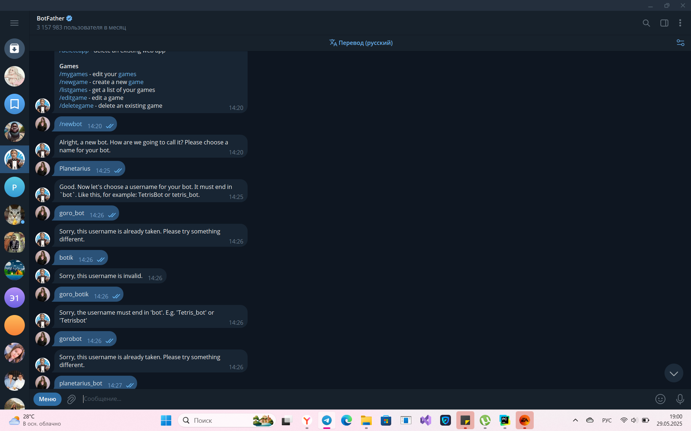

# Отчет по разработке Telegram-бота для получения гороскопов

## 1. Настройка бота
Чтобы начать настройку бота, в первую очередь нужно найти в телеграме бота BotFather, выбрать /newbot и следовать дальнейшим указаниям. В конце базовой настройки будет выдан токен(уникальный идентификатор):

## 1. Настройка среды программирования
### 1.1 Установка необходимых библиотек
Для корректной работы бота я установила следующие библиотеки: 
* pyTelegramBotAPI
* requests
* python-dotenv
Сделала я это в терминале с помощью pip install.

