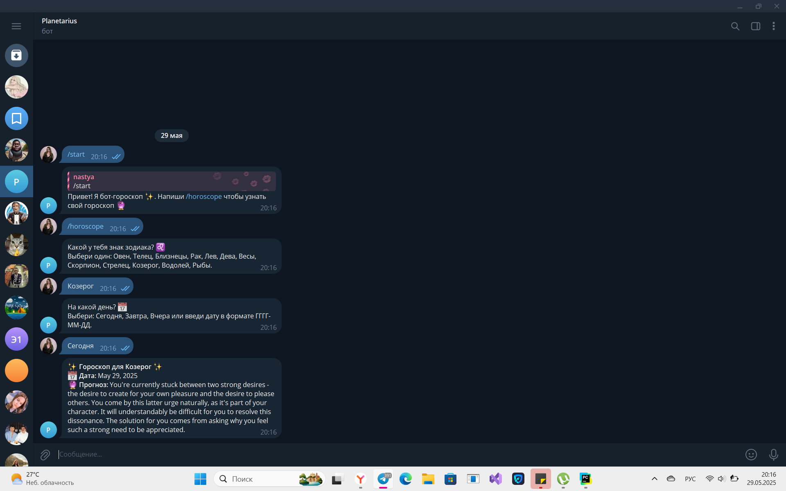

# Отчет по разработке Telegram-бота для получения гороскопов
## Введение
Данный документ описывает процесс создания Telegram-бота, предоставляющего ежедневные гороскопы для различных знаков зодиака. Бот использует открытое API для получения актуальных прогнозов.
Источник: <https://www.freecodecamp.org/news/how-to-create-a-telegram-bot-using-python/>
## 1. Исследование предметной области
### 1.1 Анализ требований
Бот должен:
- Принимать команды от пользователей
- Определять знак зодиака
- Запрашивать день для прогноза
- Отображать гороскоп в удобном формате

### 1.2 Выбор технологий
Были выбраны:
- Python
- Библиотеки pyTelegramBotAPI, requests, python-dotenv
- Сервис [Horoscope API](https://horoscope-app-api.vercel.app/) (для получения данных)
## 2. Настройка бота
Чтобы начать настройку бота, в первую очередь нужно найти в телеграме бота BotFather, выбрать /newbot и следовать дальнейшим указаниям. В конце базовой настройки будет выдан токен(уникальный идентификатор):

## 3. Настройка среды программирования
### 3.1 Установка необходимых библиотек
Для корректной работы бота я установила следующие библиотеки: 
* pyTelegramBotAPI
* requests
* python-dotenv  

Сделала я это в терминале с помощью pip install.
### 3.2 Создание конфигурационного файла
Создаем файл token.env для хранения токена бота:
```
BOT_TOKEN=токен_нашего_бота
```
## 4. Реализация функционала бота
### 4.1 Основная структура бота
```
import os
import telebot
import requests
from dotenv import load_dotenv

# Инициализация бота
load_dotenv("token.env")
BOT_TOKEN = os.getenv('BOT_TOKEN')
bot = telebot.TeleBot(BOT_TOKEN)
```
Данный фрагмент кода отвечает за базовую настройку и запуск Telegram-бота. 
Импорт библиотек:
* os - работа с операционной системой (для доступа к переменным окружения)
* telebot - основная библиотека для работы с Telegram API
* requests - отправка HTTP-запросов к API гороскопов
* dotenv - загрузка конфигурации из .env файла  

Далее мы загружаем переменные из файла token.env в текущее окружение, извлекаем значение переменной BOT_TOKEN из окружения и инициализируем бота.
### 4.2 Работа с API гороскопов
Для получения актуального гороскопа используется внешний API. Бот отправляет HTTP-запросы к API и получает данные в формате JSON. В функции get_daily_horoscope реализована следующая логика:
* Перевод входящих данных (знак зодиака и день) с русского на английский язык.
* Формирование URL и параметров запроса для доступа к API.
* Обработка ответов, включая проверку статуса и наличие необходимых данных.
* Обработка исключений при возникновении ошибок сети или данных.
## 5. Обработчики сообщений
### 5.1 Стартовые команды
При вводе команд /start или /hello, бот отправляет приветственное сообщение с предложением узнать гороскоп: 
```
@bot.message_handler(commands=['start', 'hello'])
def send_welcome(message):
    bot.reply_to(message, "Привет! Я бот-гороскоп ✨. Напиши /horoscope чтобы узнать свой гороскоп 🔮")
```
### 5.2 Получение гороскопа
Для инициирования процесса получения гороскопа используется команда /horoscope, которая запускает цепочку обработки:
```
@bot.message_handler(commands=['horoscope'])
def sign_handler(message):
    text = "Какой у тебя знак зодиака? ♌️\nВыбери один: Овен, Телец, Близнецы, Рак, Лев, Дева, Весы, Скорпион, Стрелец, Козерог, Водолей, Рыбы."
    sent_msg = bot.send_message(message.chat.id, text)
    bot.register_next_step_handler(sent_msg, day_handler)
```
### 5.3 Обработка выбора дня
Бот реагирует на ввод знака зодиака и предлагает выбрать день для гороскопа:
```
def day_handler(message):
    sign = message.text
    text = "На какой день? 📅\nВыбери: Сегодня, Завтра, Вчера или введи дату в формате ГГГГ-ММ-ДД."
    sent_msg = bot.send_message(message.chat.id, text)
    bot.register_next_step_handler(sent_msg, fetch_horoscope, sign.capitalize())
```
После выбора знака зодиака, бот запрашивает день для гороскопа и вызывает функцию для получения данных.
## 6. Запуск бота
Бот запускается с помощью метода infinity_polling, который обеспечивает его поддержку в режиме реального времени:
```
if __name__ == "__main__":
    print("✅ Бот запущен и готов к работе!")
    bot.infinity_polling()
```
## 7. Пример работы
1. Пользователь отправляет команду /start.
2. Бот отвечает приветствием и предлагает команду /horoscope.
3. Пользователь выбирает знак зодиака и день.
4. Бот отправляет запрос к API гороскопов и отвечает подробными данными.  

Пример работы: 

## Итог
Мы развернули телеграм-бота с помощью небольшого кода на Python. На данный момент это всего лишь версия демо, которая перестаёт работать, как только мы останавливаем наше приложение на Python. Чтобы он работал постоянно, можно развернуть бот на таких платформах, как Heroku, Render и так далее.
